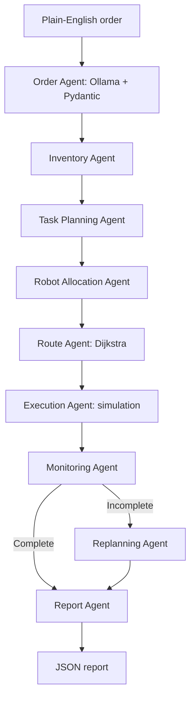

# Architecture

```mermaid
flowchart TD
 A[Plain-English order] --> B[Order Agent: Ollama + Pydantic]
 B --> C[Inventory Agent]
 C --> D[Task Planning Agent]
 D --> E[Robot Allocation Agent]
 E --> F[Route Agent: Dijkstra]
 F --> G[Execution Agent: simulation]
 G --> H[Monitoring Agent]
 H -->|Complete| J[Report Agent]
 H -->|Incomplete| I[Replanning Agent]
 I --> J
 J --> K[JSON report]
```
